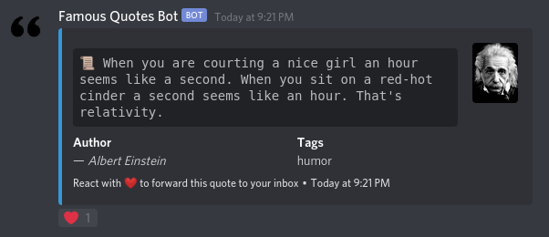

# Famous-Quotes-Bot

## :book: Description
A discord.py bot for famous quotes.

### :dart: Features
- Quote generation
- Bot information
- Help paginator

### :high_brightness: Visuals


## :bulb: Getting Started
Follow the instructions below to work on the project on your local environment.

### :clipboard: Prerequisites
In case you don't use Docker, you'll need Git, Python 3.8, Pip and a Virtual Environment (in this case, Pipenv is used as a package manager and virtual environment).

### :computer: Installation
```
# Clone this repository
$ git clone https://github.com/miguel-osuna/Famous-Quotes-Bot.git

# Go into the repository from the terminal
$ cd Famous-Quotes-Bot

# Remove current origin repository
$ git remote remove origin
```
All dependencies are listed on the Pipfile.

### :whale2: Running project with Docker
This will run the project on your local environment. 

Make sure to create a hidden folder like `envs.example` named `.envs`, with the same kind of environment variables.

```
docker-compose up -d --build
```

## :rocket: Deployment
This project includes a Procfile for Heroku, but can be deployed to any other host.
- Heroku: read the [following tutorial](https://devcenter.heroku.com/articles/getting-started-with-python) to learn how to deploy to your heroku account..

## :wrench: Built With
- [discord.py](https://discordpy.readthedocs.io/en/latest/) - Python Library for Discord API
- [Quotes API](https://elvxcu055k.execute-api.us-east-1.amazonaws.com/production/documentation) - API built for quote generation

## Project Documentation
For more, check the [project documentation](https://top.gg/bot/791149821511073812)

## :performing_arts: Authors
- **Miguel Osuna** - https://github.com/miguel-osuna

## :ledger: License
This project is licensed under the MIT License - see the LICENSE.md file for details.

